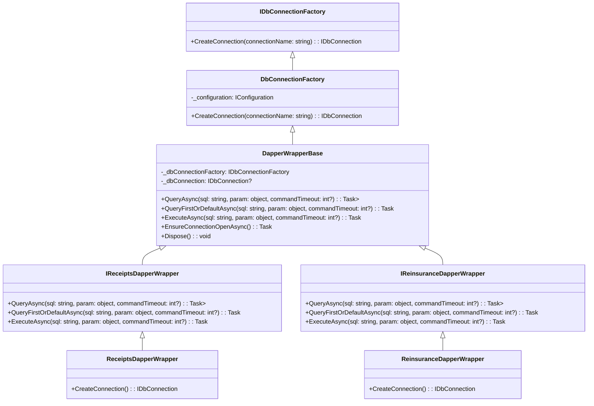

# `DbConnectionFactory` และ `DapperWrapperBase` **Class Diagram** :

 
# Class Diagram: DbConnectionFactory และ DapperWrapperBase

## ภาพรวม

การทำงานร่วมกันระหว่าง `DbConnectionFactory` และ `DapperWrapperBase` โดยที่ `DbConnectionFactory` มีหน้าที่ในการสร้างการเชื่อมต่อฐานข้อมูล ส่วน `DapperWrapperBase` ใช้การเชื่อมต่อเหล่านั้นในการดำเนินการคำสั่ง SQL ผ่าน Dapper

### คลาสที่เกี่ยวข้อง:
1. **DbConnectionFactory** - คลาสสำหรับสร้างการเชื่อมต่อ Oracle database
2. **DapperWrapperBase** - คลาสแอบสแตรกที่ใช้ในการดำเนินการคำสั่ง SQL โดยใช้ Dapper และตรวจสอบให้การเชื่อมต่อพร้อมใช้งาน

#

## Class Diagram Flow

### 1. **คลาส DbConnectionFactory**
- **ความรับผิดชอบ**: สร้าง `OracleConnection` โดยใช้ Connection String ที่ดึงมาจาก `IConfiguration`
- **เมธอด**: `CreateConnection(string connectionName)`
  - **อินพุต**: `connectionName` (เช่น `"Receipts"`, `"Reinsurance"`)
  - **เอาต์พุต**: `OracleConnection` (ซึ่งเป็นการนำไปใช้จาก `IDbConnection`)

```plaintext
+------------------------+
| DbConnectionFactory    |
+------------------------+
| + CreateConnection()   |  <-- สร้าง OracleConnection
|                        |
+------------------------+
```

### 2. **คลาส DapperWrapperBase**
- **ความรับผิดชอบ**: ใช้ Dapper ดำเนินการคำสั่ง SQL แบบอะซิงโครนัส และตรวจสอบให้การเชื่อมต่อพร้อมใช้งาน
- **เมธอด**:
  - `QueryAsync<T>(...)`
  - `QueryFirstOrDefaultAsync<T>(...)`
  - `ExecuteAsync(...)`
  - **ใช้**: `IDbConnectionFactory` เพื่อสร้างการเชื่อมต่อและดำเนินการคำสั่ง SQL

```plaintext
+------------------------+
| DapperWrapperBase      |
+------------------------+
| + QueryAsync<T>()      |  <-- ใช้ DbConnectionFactory เพื่อเปิดการเชื่อมต่อและดำเนินการ query
| + QueryFirstOrDefault()|
| + ExecuteAsync()       |
|                        |
| + EnsureConnectionOpen()|
|                        |
+------------------------+
```

### การทำงานร่วมกัน:

1. **DbConnectionFactory** จะสร้าง `OracleConnection` โดยใช้ `connectionName` เพื่อดึง `Connection String` จากการตั้งค่าของระบบ (Configuration).
   - ตัวอย่าง: `connectionName = "Receipts"` จะดึง `Connection String` ที่เกี่ยวข้องจากการตั้งค่าแล้วสร้าง `OracleConnection`

2. **DapperWrapperBase** จะเรียกใช้ `DbConnectionFactory` เพื่อสร้างการเชื่อมต่อ (`DbConnectionFactory.CreateConnection("Receipts")`)
   - หลังจากที่ได้รับการเชื่อมต่อแล้ว จะตรวจสอบว่าเชื่อมต่อเปิดอยู่หรือไม่ โดยใช้ `EnsureConnectionOpenAsync()` และเมื่อเชื่อมต่อพร้อมใช้งานแล้ว จะใช้ Dapper เพื่อดำเนินการ query เช่น `QueryAsync`, `QueryFirstOrDefaultAsync`, หรือ `ExecuteAsync`
   - เมื่อดำเนินการเสร็จแล้ว การเชื่อมต่อจะถูกปิด (Dispose)

```plaintext
+------------------------+                         +--------------------------+
| DbConnectionFactory    |                         | DapperWrapperBase        |
+------------------------+                         +--------------------------+
|                        |                         |                          |
| - CreateConnection()   |----------------------->| - CreateConnection()     |
|                        |                         |                          |
| - Retrieve Connection  |                         | - Ensure Connection Open |
|                        |                         | - Execute SQL Queries    |
+------------------------+                         +--------------------------+
```

### ลำดับการทำงาน:

1. **DbConnectionFactory**:
   - รับพารามิเตอร์ `connectionName` (เช่น `"Receipts"` หรือ `"Reinsurance"`)
   - ดึง `Connection String` จากการตั้งค่าของระบบ (`_configuration.GetConnectionString(connectionName)`)
   - สร้าง `OracleConnection` โดยใช้ `Connection String`

2. **DapperWrapperBase**:
   - รับ `IDbConnectionFactory` ผ่านการฉีดพึ่งพา (Dependency Injection)
   - เรียกใช้เมธอด `CreateConnection("Receipts")` เพื่อรับการเชื่อมต่อ
   - ตรวจสอบว่าเชื่อมต่อเปิดอยู่ (`EnsureConnectionOpenAsync()`)
   - ดำเนินการ query โดยใช้ Dapper เช่น `QueryAsync`, `QueryFirstOrDefaultAsync`, หรือ `ExecuteAsync`

---

## Class Diagram สุดท้าย

```plaintext
+------------------------+       +------------------------+
|  DbConnectionFactory   |       | DapperWrapperBase      |
+------------------------+       +------------------------+
|  + CreateConnection()  |       |  + QueryAsync<T>()     |
|  - Get ConnectionString|       |  + QueryFirstOrDefault()|
|                        |       |  + ExecuteAsync()      |
+------------------------+       |  + EnsureConnectionOpen()|
                                 +------------------------+
                                         |
                                         v
                              +--------------------------+
                              |  OracleConnection        |
                              +--------------------------+
                              |  - Execute SQL Queries   |
                              +--------------------------+
```

#

## สรุป

- **DbConnectionFactory**: มีหน้าที่ในการสร้างการเชื่อมต่อฐานข้อมูลโดยการดึง Connection String จากการตั้งค่า
- **DapperWrapperBase**: ใช้ `DbConnectionFactory` เพื่อสร้างการเชื่อมต่อ และดำเนินการคำสั่ง SQL ผ่าน Dapper โดยตรวจสอบให้แน่ใจว่าเชื่อมต่อพร้อมใช้งาน
- การแยกหน้าที่แบบนี้ช่วยให้การจัดการการเชื่อมต่อและการดำเนินการคำสั่ง SQL สามารถแยกออกจากกันและทดสอบได้ง่าย

```
 
