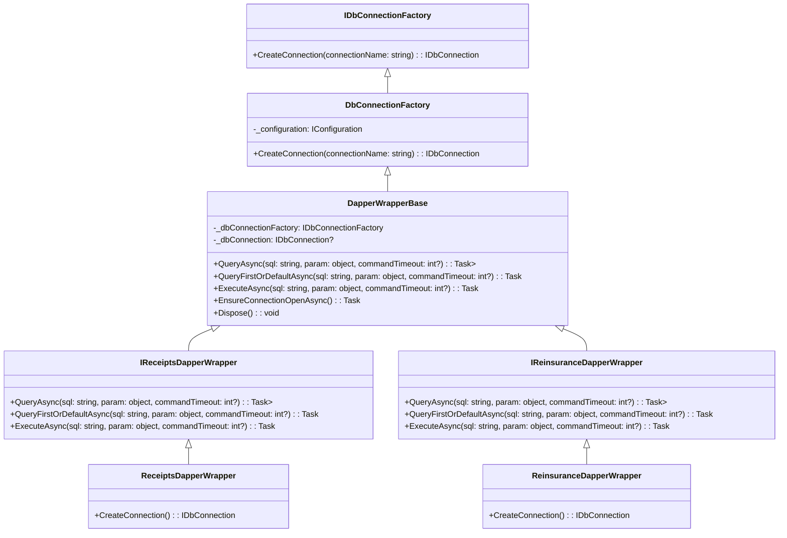

```mermaid

classDiagram
    class IDbConnectionFactory {
        +CreateConnection(connectionName: string): IDbConnection
    }

    class DbConnectionFactory {
        -_configuration: IConfiguration
        +CreateConnection(connectionName: string): IDbConnection
    }

    class DapperWrapperBase {
        -_dbConnectionFactory: IDbConnectionFactory
        -_dbConnection: IDbConnection?
        +QueryAsync<T>(sql: string, param: object, commandTimeout: int?): Task<IEnumerable<T>>
        +QueryFirstOrDefaultAsync<T>(sql: string, param: object, commandTimeout: int?): Task<T>
        +ExecuteAsync(sql: string, param: object, commandTimeout: int?): Task<int>
        +EnsureConnectionOpenAsync(): Task
        +Dispose(): void
    }

    class IReceiptsDapperWrapper {
        +QueryAsync<T>(sql: string, param: object, commandTimeout: int?): Task<IEnumerable<T>>
        +QueryFirstOrDefaultAsync<T>(sql: string, param: object, commandTimeout: int?): Task<T>
        +ExecuteAsync(sql: string, param: object, commandTimeout: int?): Task<int>
    }

    class ReceiptsDapperWrapper {
        +CreateConnection(): IDbConnection
    }

    class IReinsuranceDapperWrapper {
        +QueryAsync<T>(sql: string, param: object, commandTimeout: int?): Task<IEnumerable<T>>
        +QueryFirstOrDefaultAsync<T>(sql: string, param: object, commandTimeout: int?): Task<T>
        +ExecuteAsync(sql: string, param: object, commandTimeout: int?): Task<int>
    }

    class ReinsuranceDapperWrapper {
        +CreateConnection(): IDbConnection
    }

    IDbConnectionFactory <|-- DbConnectionFactory
    DbConnectionFactory <|-- DapperWrapperBase
    DapperWrapperBase <|-- IReceiptsDapperWrapper
    IReceiptsDapperWrapper <|-- ReceiptsDapperWrapper
    DapperWrapperBase <|-- IReinsuranceDapperWrapper
    IReinsuranceDapperWrapper <|-- ReinsuranceDapperWrapper

```
