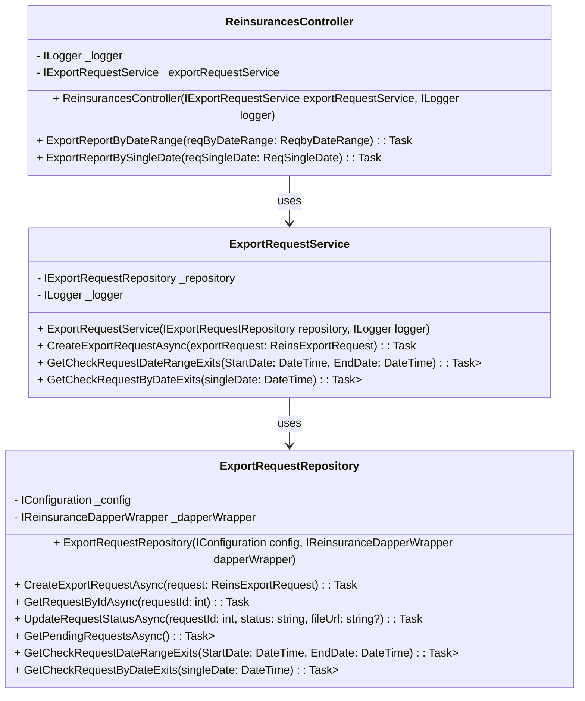

# Reinsurances **Class Diagram** 

ที่อธิบายความสัมพันธ์ระหว่าง `ReinsurancesController`, `ExportRequestService`, และ `ExportRequestRepository`
#

### การอธิบายแต่ละคลาส

1. **ReinsurancesController**
   - เป็น Controller ของ API ที่ใช้เพื่อรับคำขอการ Export รายงานผ่านวันที่ (Date Range) หรือวันที่เดียว (Single Date).
   - ใช้ `ExportRequestService` ในการจัดการข้อมูลเกี่ยวกับการสร้างคำขอ Export และตรวจสอบการมีอยู่ของคำขอที่เคยถูกส่งมาแล้ว.

2. **ExportRequestService**
   - เป็น Service ที่ใช้ในการจัดการกับคำขอการ Export โดยทำงานร่วมกับ `ExportRequestRepository`.
   - มีฟังก์ชันในการสร้างคำขอ Export และตรวจสอบการมีอยู่ของคำขอที่ถูกส่งในช่วงเวลาที่ระบุ.

3. **ExportRequestRepository**
   - เป็น Repository ที่เชื่อมต่อกับฐานข้อมูล (โดยใช้ Dapper) เพื่อทำงานกับข้อมูล `ReinsExportRequest` ในฐานข้อมูล.
   - ฟังก์ชันต่าง ๆ ได้แก่ การสร้างคำขอใหม่, อัปเดตสถานะของคำขอ, และการตรวจสอบการมีอยู่ของคำขอในช่วงเวลาหรือวันที่ระบุ.

### ความสัมพันธ์ระหว่างคลาส

- `ReinsurancesController` ใช้ `ExportRequestService` เพื่อให้บริการ API.
- `ExportRequestService` ใช้ `ExportRequestRepository` ในการติดต่อกับฐานข้อมูลเพื่อดึงข้อมูลและบันทึกข้อมูล.
