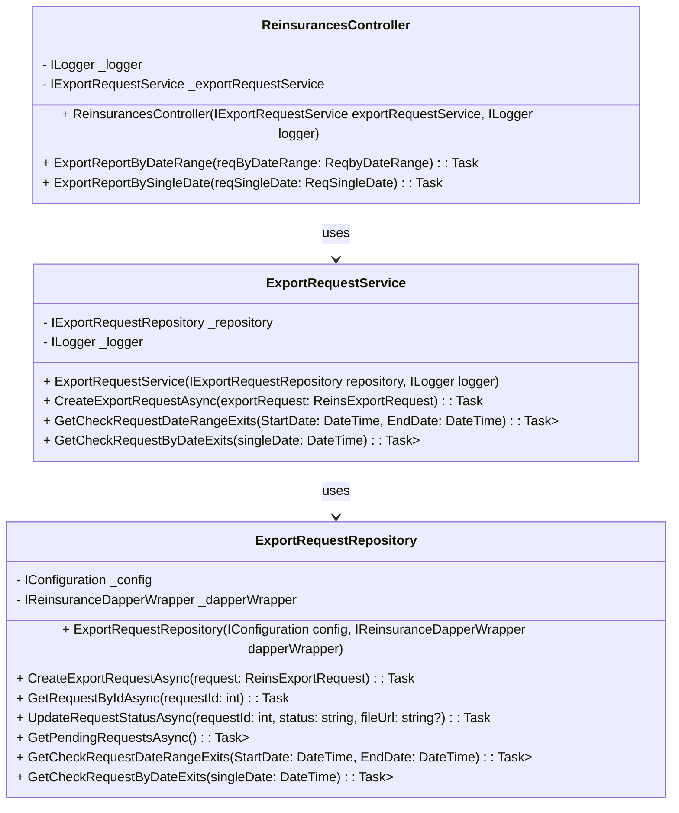

# `ReinsurancesController` Class

### `using` Directives:
- **`using Microsoft.AspNetCore.Mvc;`**: ใช้สำหรับการสร้าง API controller โดยใช้ ASP.NET Core MVC framework.
- **`using tni.gis.API.Constants.Logs;`**: นำเข้า constants ที่เกี่ยวข้องกับการ logging ในระบบ.
- **`using tni.gis.API.Models;`**: นำเข้า model ที่ใช้ในการรับ-ส่งข้อมูลผ่าน API.
- **`using tni.gis.Reinsurances.Application.Interfaces;`**: นำเข้า interfaces ของ service ที่ใช้ใน application สำหรับจัดการคำขอการ export ข้อมูล (Export Requests).
- **`using tni.gis.Reinsurances.Domain.Entities;`**: นำเข้า entities ที่ใช้ในการจัดเก็บข้อมูลเกี่ยวกับการ export ข้อมูล.
- **`using tni.gis.SharedKernel.Constants;`**: นำเข้า constants ที่ใช้ในระบบในส่วนต่างๆ เช่น ค่าเริ่มต้น หรือประเภทต่างๆ ที่ใช้งานร่วมกัน.

### `ReinsurancesController` Class:
- **`public class ReinsurancesController : ControllerBase`**: เป็น controller สำหรับจัดการ API endpoint ที่เกี่ยวกับการจัดการการส่งออกข้อมูล (Reinsurance) โดยตรงจาก `ControllerBase` ซึ่งเป็น base class สำหรับ API controllers ใน ASP.NET Core.
  
#### Constructor:
- **`public ReinsurancesController(IExportRequestService exportRequestService, ILogger<ReinsurancesController> logger)`**: constructor ที่ใช้ inject dependencies ทั้ง `IExportRequestService` และ `ILogger<ReinsurancesController>`.
  - **`_logger`**: ใช้สำหรับการ log ข้อความต่างๆ ที่เกี่ยวข้องกับการทำงานของ controller.
  - **`_exportRequestService`**: ใช้สำหรับเรียกใช้ logic ในการสร้าง export request และตรวจสอบข้อมูลการ export.

### `ExportReportByDateRange` Action Method:
- **`[HttpPost("report-by-date-range")]`**: กำหนด route ที่ใช้สำหรับเรียก API นี้ เมื่อมีการส่ง request แบบ POST ไปที่ `/api/v1/reinsurances/report-by-date-range`.
- **`public async Task<IActionResult> ExportReportByDateRange([FromBody] ReqbyDateRange reqByDateRange)`**: เป็น method ที่รับข้อมูลจาก request body ในรูปแบบของ `ReqbyDateRange` object ซึ่งประกอบไปด้วย `START_DATE` และ `END_DATE`.
- **`_logger.LogInformation($"{LogConstants.PROCESS_START}: ExportReportByDateRange()");`**: เริ่มต้นการ log ว่า method นี้เริ่มทำงานแล้ว.
- **`var checkDataExists = await _exportRequestService.GetCheckRequestDateRangeExits(reqByDateRange.START_DATE, reqByDateRange.END_DATE);`**: ตรวจสอบว่ามี request export ที่มีช่วงวันที่ซ้ำกับที่รับมาหรือไม่.
- **`if (checkDataExists.Any())`**: ถ้ามีการ request export ในช่วงวันที่นี้แล้ว (ข้อมูลซ้ำ):
  - **`_logger.LogWarning($"{LogConstants.PROCESS_WARNING}: ...");`**: log warning ว่ามีการ request ที่ซ้ำ.
  - **`return Ok(ApiResponse<object>.BadRequestResponse(message));`**: ส่งคำตอบกลับไปว่า request นี้ไม่สามารถทำได้เนื่องจากซ้ำกัน.
- **`var byDateRange = new ReinsExportRequest { ... };`**: สร้าง object `ReinsExportRequest` เพื่อเก็บข้อมูลการ export ตามช่วงวันที่ที่ได้รับ.
- **`var requestId = await _exportRequestService.CreateExportRequestAsync(byDateRange);`**: สร้างการ request export ข้อมูลใหม่ในระบบ และรับ `requestId` กลับมา.
- **`_logger.LogInformation($"{LogConstants.PROCESS_SUCCESS}: ...");`**: log ว่าการ request export ข้อมูลสำเร็จ.
- **`return Ok(ApiResponse<object>.SuccessResponse(new { RequestId = requestId }, successMessage));`**: ส่งคำตอบกลับว่า request การ export ข้อมูลสำเร็จพร้อมกับ `requestId`.

#### Exception Handling:
- **`catch (Exception ex)`**: หากเกิดข้อผิดพลาดระหว่างการทำงาน:
  - **`_logger.LogError(ex, $"{LogConstants.PROCESS_ERROR}: ...");`**: log ข้อผิดพลาดที่เกิดขึ้น.
  - **`return StatusCode(500, ApiResponse<object>.ErrorResponse("เกิดข้อผิดพลาดระหว่างดำเนินการ Export."));`**: ส่ง status code 500 พร้อมกับข้อความ error.

### `ExportReportBySingleDate` Action Method:
- **`[HttpPost("report-by-single-date")]`**: กำหนด route สำหรับเรียก API นี้ด้วย POST request ไปที่ `/api/v1/reinsurances/report-by-single-date`.
- **`public async Task<IActionResult> ExportReportBySingleDate([FromBody] ReqSingleDate reqSingleDate)`**: รับข้อมูลจาก request body ในรูปแบบ `ReqSingleDate` ที่ประกอบด้วย `SINGLE_DATE`.
- **`_logger.LogInformation($"{LogConstants.PROCESS_START}: ExportReportBySingleDate()");`**: เริ่มต้นการ log ว่า method นี้เริ่มทำงาน.
- **`var checkDataExite = await _exportRequestService.GetCheckRequestByDateExits(reqSingleDate.SINGLE_DATE);`**: ตรวจสอบว่ามีการ request export ในวันที่นี้แล้วหรือไม่.
- **`if (checkDataExite.Any())`**: ถ้ามีการ request export ในวันที่นี้แล้ว:
  - **`_logger.LogWarning($"{LogConstants.PROCESS_WARNING}: ...");`**: log warning.
  - **`return Ok(ApiResponse<object>.BadRequestResponse(message));`**: ส่งคำตอบกลับว่า request นี้ไม่สามารถทำได้เนื่องจากซ้ำกัน.
- **`ReinsExportRequest singleDate = new();`**: สร้าง `ReinsExportRequest` เพื่อเก็บข้อมูลการ export ข้อมูลในวันที่เดียว.
- **`var requestId = await _exportRequestService.CreateExportRequestAsync(singleDate);`**: สร้าง request ใหม่และรับ `requestId`.
- **`_logger.LogInformation($"{LogConstants.PROCESS_SUCCESS}: ...");`**: log ว่าการ request export ข้อมูลสำเร็จ.
- **`return Ok(ApiResponse<object>.SuccessResponse(new { RequestId = requestId }, successMessage));`**: ส่งคำตอบกลับว่า request สำเร็จ.

#### Exception Handling:
- **`catch (Exception ex)`**: หากเกิดข้อผิดพลาด:
  - **`_logger.LogError(ex, $"{LogConstants.PROCESS_ERROR}: ...");`**: log ข้อผิดพลาด.
  - **`return StatusCode(500, ApiResponse<object>.ErrorResponse(messageError));`**: ส่ง status code 500 พร้อมกับ error message.

### Summary:
โค้ดนี้มีการจัดการกับการ request การ export ข้อมูลที่เกี่ยวข้องกับ Reinsurance ตามช่วงวันที่หรือวันที่เดียว และมีการตรวจสอบข้อมูลที่ซ้ำกันก่อนการสร้าง request ใหม่ เพื่อป้องกันการทำงานซ้ำ และมีการ log ข้อความเพื่อให้สามารถตรวจสอบการทำงานได้ง่ายขึ้น.

# Reinsurances **Class Diagram** 

แสดงความสัมพันธ์ระหว่าง `ReinsurancesController`, `ExportRequestService`, และ `ExportRequestRepository`
#

### การอธิบายแต่ละคลาส

1. **ReinsurancesController**
   - เป็น Controller ของ API ที่ใช้เพื่อรับคำขอการ Export รายงานผ่านวันที่ (Date Range) หรือวันที่เดียว (Single Date).
   - ใช้ `ExportRequestService` ในการจัดการข้อมูลเกี่ยวกับการสร้างคำขอ Export และตรวจสอบการมีอยู่ของคำขอที่เคยถูกส่งมาแล้ว.

2. **ExportRequestService**
   - เป็น Service ที่ใช้ในการจัดการกับคำขอการ Export โดยทำงานร่วมกับ `ExportRequestRepository`.
   - มีฟังก์ชันในการสร้างคำขอ Export และตรวจสอบการมีอยู่ของคำขอที่ถูกส่งในช่วงเวลาที่ระบุ.

3. **ExportRequestRepository**
   - เป็น Repository ที่เชื่อมต่อกับฐานข้อมูล (โดยใช้ Dapper) เพื่อทำงานกับข้อมูล `ReinsExportRequest` ในฐานข้อมูล.
   - ฟังก์ชันต่าง ๆ ได้แก่ การสร้างคำขอใหม่, อัปเดตสถานะของคำขอ, และการตรวจสอบการมีอยู่ของคำขอในช่วงเวลาหรือวันที่ระบุ.

### ความสัมพันธ์ระหว่างคลาส

- `ReinsurancesController` ใช้ `ExportRequestService` เพื่อให้บริการ API.
- `ExportRequestService` ใช้ `ExportRequestRepository` ในการติดต่อกับฐานข้อมูลเพื่อดึงข้อมูลและบันทึกข้อมูล.
